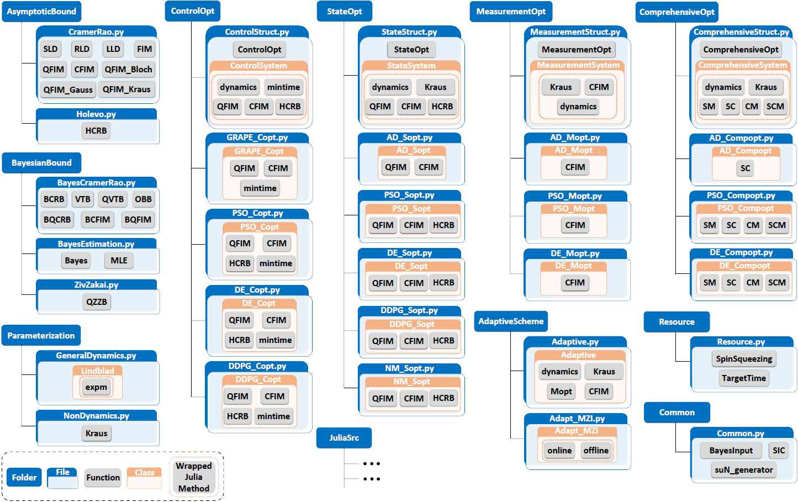

# **Welcome to the QuanEstimation**
QuanEstimation is a Python-Julia based open-source toolkit for quantum parameter estimation
which covers the calculation of the quantum metrological tools and quantum resources, the 
optimization of the probe state, control and measurement in quantum metrology. Futhermore, 
QuanEstimation can also perform comprehensive optimization of the probe state, control and 
measurement to generate optimal quantum parameter estimation schemes, and generate adaptive 
measurement schemes. The package structure of QuanEstimation can be seen in the following 
figure

<figure markdown>
  { width="800" }
  <figcaption>The package structure of QuanEstimation. The blue boxes, white boxes with blue 
  edges, white boxes with orange boxes and gray boxes are folders, files, classes and functions in 
  Python. The gray boxes with dotted orange boundaries represents the methods that solved in Julia.
  </figcaption>
</figure>

The package contains several well-used metrological tools, such as quantum (classical) 
Cramér-Rao bounds, Hevolo Cramér-Rao bound and Bayesian versions of quantum (classical) 
Cramér-Rao bounds, quantum Ziv-Zakai bound, and Bayesian estimation. The users can use these
bounds as the objective functions to optimize the probe state, control, measurement and 
simultaneous optimizations among them. The optimization methods include the gradient-based 
algorithms such as the gradient ascent pulse engineering (GRAPE), GRAPE algorithm based on the 
automatic differentiation (auto-GRAPE), automatic differentiation (AD) and the 
gradient-free algorithms such as particle swarm optimization (PSO), differential evolution (DE), 
deep deterministic policy gradients (DDPG) and reverse iterative (RI) algorithm.

The interface of QuanEstimation is written in Python, but the most calculation processes are
executed in Julia for the computational efficiency. Therefore, QuanEstimation also has a full
Julia version apart from the Python-Julia version. 

---